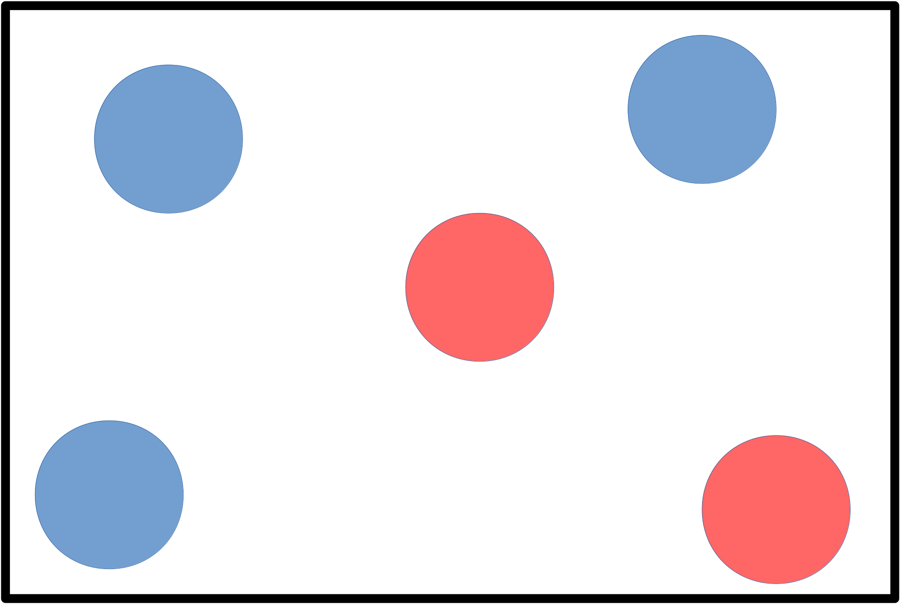
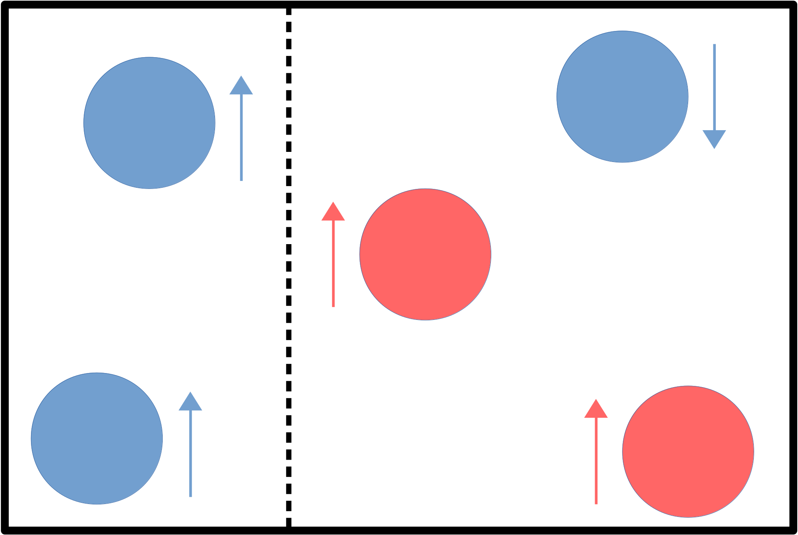
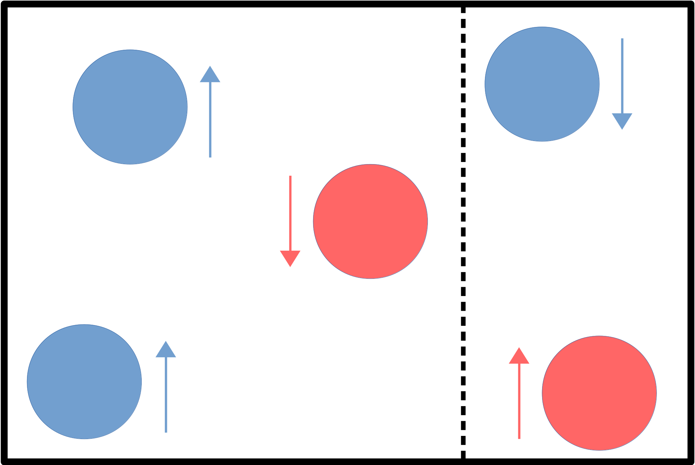
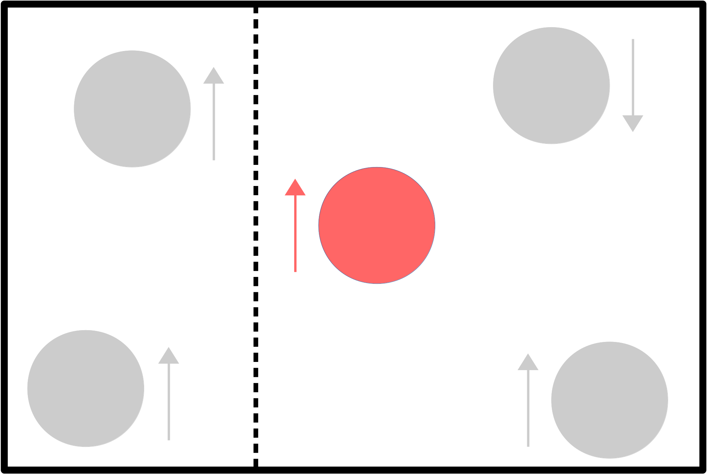
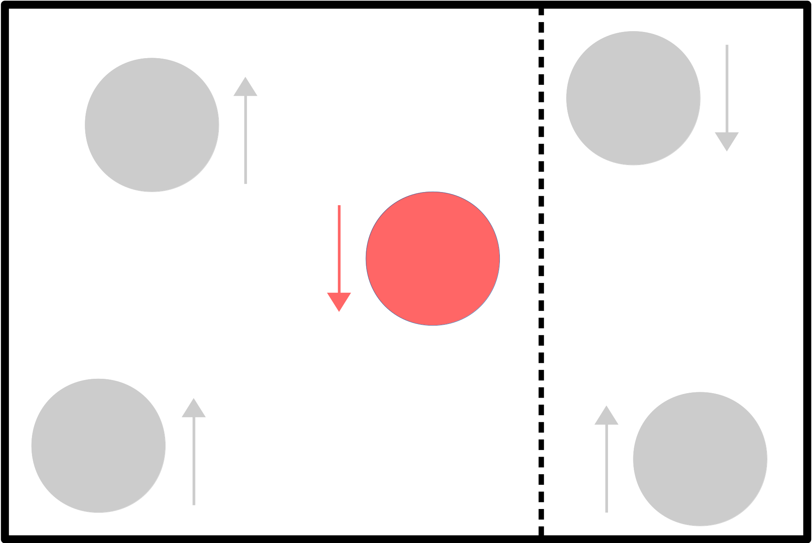
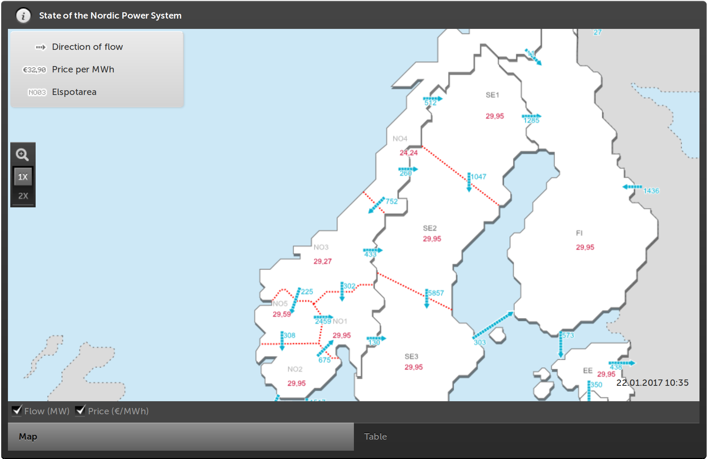
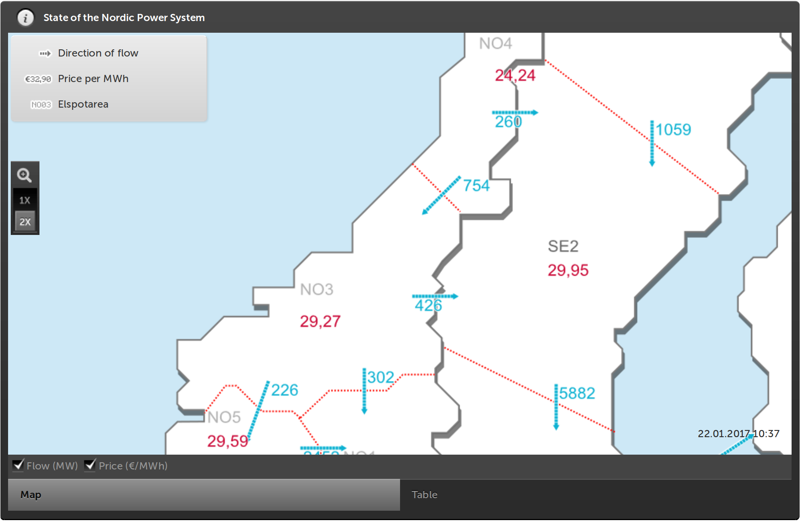
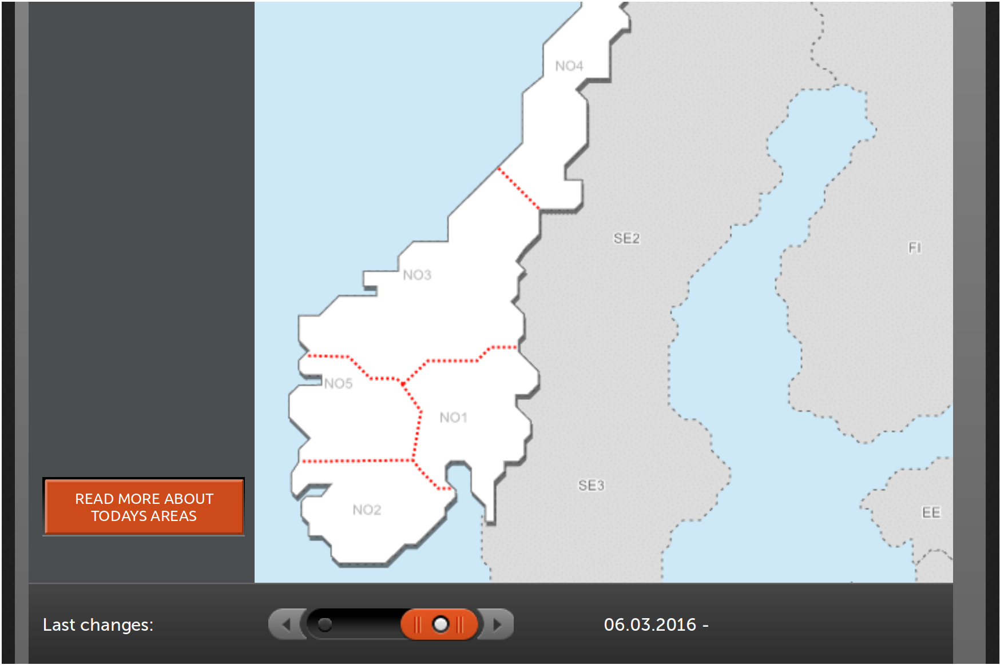
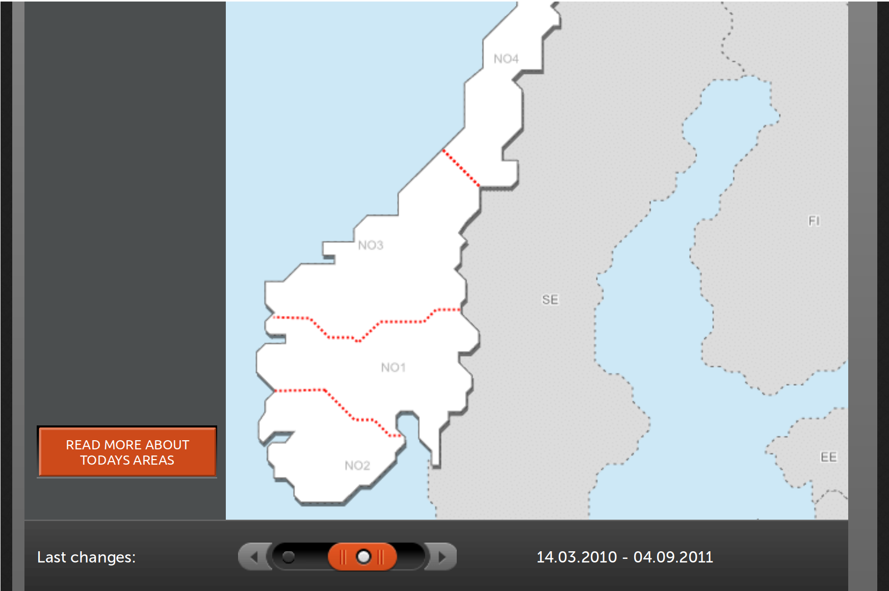

```{r setup, include=FALSE}
options(htmltools.dir.version = FALSE)

library(knitr)
opts_chunk$set(
  fig.width=8, fig.height=6, fig.align="center",
  out.width="748px", #out.length="520.75px",
  dpi=300, #fig.path='Figs/',
  cache=T,
  echo=F, warning=F, message=F
  )

## Bilbiography
library(RefManageR)
BibOptions(check.entries = FALSE, bib.style = "authoryear", style = "markdown",
           dashed = TRUE)
bib <- ReadBib("/home/grant/Dropbox/LaTeX/BiBTeX/myrefs.bib")

## Other libraries
library(tidyverse)
library(lubridate)
library(forcats)
# library(DT)
library(hrbrthemes)
library(extrafont)
library(grid)
library(scales)
library(RColorBrewer)
#library(plotly)
library(leaflet)
library(maps)

## Month order from Summer to Winter (useful for plots)
month_ord <- 
  c("May", "Jun", "Jul", "Aug", "Sep", "Oct",
    "Nov", "Dec", "Jan", "Feb", "Mar", "Apr")

## For plots
font_type <- 
  choose_font(c("Fira Sans", "Yanone Kaffeesatz"))

# font_size <- 20
# strip_size <- 20
# ax_size <- 18
# cap_size <- 15
theme_set(
  theme_ipsum(
    base_family = font_type,
    # plot_margin = margin(10, 10, 10, 10),
    # base_size = font_size,
    # plot_title_size = font_size,
    # strip_text_size = strip_size,
    # axis_title_size = ax_size,
    # caption_size = cap_size,
    axis_title_just = "mc"
    ) +
    theme(strip.text = element_text(hjust = 0.5))
)
```

# Motivation

### Why is market power bad?
--
count: false
- Econ 101: Deadweight loss b/c dominant firms withhold production. 

--
count: false

### But is this really true?
--
count: false
- Remarkably difficult to verify empirically. 
- Identification is tough. Requires lots of imposed structure...
  
???
- Identification is hard (especially in a dynamic setting). 
- Firms don't merge with other firms by accident, or enter and exit markets at random. 
- They do so b/c of expectations about future profits, demand, etc.

--
count: false
### This paper 
- Identify causal impact of market power on firm behaviour (in reduced-form setting).
- Bridge the gap between theory and empirics. 

---

# Approach and contribution

### Exogenous formation of localized electricity markets
- Source: Transmission constraints.
- The *definition* of the market is changing over time.

### Plant-level data
- Norwegian hydropower firms.
- Hydropower offers specific empirical advantages (more on this later).

???
- It's not that firms are entering or exiting a set market. Rather: Changing boundaries of the market *itself* causes variation in competition.
- In so doing, provide an improved correspondence between theory and empirics.

--
count: false

### Research questions
  1. Do firms withold production when they gain more market power? 
  2. Welfare effects in this market?
  3. Are there environmental consequences?

---
count: false

# Approach and contribution

### Exogenous formation of localized electricity markets
- Source: Transmission constraints.
- The *definition* of the market is changing over time.

### Plant-level data
- Norwegian hydropower firms.
- Hydropower offers specific empirical advantages (more on this later).

### Research questions
  1. Do firms withold production when they gain more market power? (**Yes**)
  2. Welfare effects in this market? (**Modest, but...**)
  3. Are there environmental consequences? (**Yes**)

---

class: inverse, center, middle

# Introduction

<html><div style='float:left'></div><hr color='#EB811B' size=1px width=720px></html> 

(Or: Why should you care?)

---

# Concerns about market power

Economists (and politicians) increasingly worried about market power.

- Stagnant wages and falling labour productivity shares: `r Citet(bib, c("autor2017superstar", "azar2017concentration", "benmelech2018strong"))`.
- Slowdown in aggregate output: `r Citet(bib, c("deloecker2017rise"))`. 

Market power appears to be growing across various dimensions.
- Nationally and globally: `r Citet(bib, c("azar2018concentration", "deloecker2018global"))`.
- Traditional and nascent markets `r Citet(bib, c("benmelech2018strong", "dube2018monopsony"))`.

--
count: false

These concerns have very little to say about hydropower (specifically). So why focus on it? 

Well, since you asked...

---

# Hydropower is important

```{r primary_energy, echo=FALSE, message=FALSE, warning=FALSE}
type <- c("Oil", "Coal", "Gas", "Hydro", "Nuclear", "Other")
tpes <- c(32.6, 30.0, 23.7, 6.8, 4.4, 2.5) ## BP Statistical Review (2015): Year = 2014
elec <- c(5.0, 40.4, 22.5, 16.2, 10.9, 5.0)

energy <- tbl_df(data.frame(cbind(type, tpes, elec)))

energy <- 
  energy %>%
  gather(form, perc, -type) %>%
  mutate(perc = as.numeric(perc)) %>%
  mutate(form_labs = ifelse(form == "tpes", "(a) Global primary energy \n", "(b) Global electricity \n")) 

energy$type <- factor(energy$type, levels = type)
energy$form_labs <- factor(energy$form_labs, levels = c("(a) Global primary energy \n", "(b) Global electricity \n"))

my_grbu <- c(rep("#BDBDBD", times = 3), brewer.pal(3, "Blues")[2], rep("#BDBDBD", times = 2))

energy %>% 
  filter(!is.na(perc)) %>%
  ggplot(aes(x = factor(type), y = perc/100, fill = factor(type)), color = factor(type)) +  
  stat_summary(fun.y = mean, geom = "bar") +
  geom_text(
    data = energy %>% filter(type=="Hydro"),
    aes(label=paste0(round(perc, 0), "%"), family = font_type), 
    position=position_dodge(width=0.9), vjust=-0.5
    ) +
  scale_fill_manual(values = my_grbu, breaks = type) +
  scale_y_continuous(labels = percent) +
  labs(
    x = NULL, y = NULL,
    caption = "\n Source: BP (2016)"
    ) + 
  facet_wrap(~ form_labs, scales = "free_x") +
  theme(
    legend.position = "none",
    # text = element_text(family = font_type),
    axis.text.x = element_text(angle = 45, vjust = 0.95, hjust = 1.01),
    # strip.text = element_text(size = strip_size),
    # strip.background = element_rect(fill = "white"), ## Facet strip
    panel.spacing = unit(4, "lines") ## Increase gap between facet panels
    )

```

???
- Also integration with other renewables. 
- "Battery" for other areas. E.g. €2bn NordLink cable btw Norway and Germany (2019). 
---

# Hydropower is unique

### Empirical advantages:
- Negligible marginal costs
- Dispatchable production
- Homogenous end-good (electricity).

???
- Can abstract from many of the usual concerns in empirical I/O: MC estimation, product differentiation, branding...
- Inflows are seasonal (stochastic), but storable.
- Dynamic optimisation problem.
- Dominant firms increase profits by witholding production during periods with inelastic demand.

---

# Literature

### Theory and other regions 

- `r Citet(bib, c("wolfram1999duopoly", "joskow2000transmission", "borenstein2000competitive", "borenstein2002california", "wolak2003measuring", "musgens2006quantifying", "sweeting2007england", "puller2007pricing", "mansur2007oligopolists", "hortacsu2008strategic", "reguant2014startup", "davis2016nuclear"))`
- This study: More advantageous research design. Richer variation in market power over longer period of time.

### Nordic focus

- `r Citet(bib, c("johnsen1999zonal", "hjalmarsson2000nordpool", "steen2004bottlenecks", "kauppi2008empirical", "fridolfsson2009market", "mirza2012transmission"))`
- This study: Overcomes lack of firm-level data and narrow focus (i.e. not just short-run price deviations).

???
- General finding of previous literature is one of healthy competition, but with some scope for exercising local market power.
- Don't need to impose any structure on the data or models, nor do I require simulation and MC estimation.
- I find direct evidence of strategic, intertemporal firm behaviour over longer periods of time.

---

class: inverse, center, middle

# Theory

<html><div style='float:left'></div><hr color='#EB811B' size=1px width=720px></html> 

---
name: theory

# Production (opportunity cost of water)

### Competition
- Equalise prices across periods (*a la* Hotelling).

### Market power
- Shift resources across periods (e.g. [monopolist case](#monopolist)).
- Undersupply in more inelastic demand periods. Oversupply in more elastic ones.

### Testable implication
- Dominant firms should maintain fuller reservoirs in inelastic demand periods. 

???
- Production in a hydro system is a dynamic optimisation problem.
  - How much to use today vs save for tomorrow?
  - Producer's decision is driven by the opportunity cost of water.
- Hotelling arbitrage argument: Prices equalised across periods by producing $\propto$ demand.
- Although, discounting not really appropriate for hydropower production horizon.
- General result is robust to various extensions (trade, uncertainty, etc.)
- P's and Q's diverge from their social optimums.
- Implies an observable difference in reservoir management. 

---
class: inverse, center, middle

# Institutional features

<html><div style='float:left'></div><hr color='#EB811B' size=1px width=720px></html> 

---

# Nord Pool

### Elspot market(s)
- Norway liberalised its electricity sector in 1991.
- By 2000: NOR, SWE, FIN and DNK all part of *Nord Pool*. 
  - The world's first (and still largest) multi-national power exchange.
- Foundation of Nord Pool is the day-ahead *Elspot* market.
- Elspot market comprises distinct bidding areas.

### Role of transmission constraints
- Not binding: Common system price in all areas.
- Binding: Areas become their own markets.
  - Creates opportunities for exploiting local market power.

---

# Stylised example

<div align="center">

</div>

- <span style="color:#729dce"><b>Blue:</b></span> 60% market share.
- <span style="color:#ff6665"><b>Red:</b></span> 40% market share.

---

# Stylised example (cont.)

<div align="center">

</div>

- <span style="color:#729dce"><b>Blue</b></span> 100% $(\uparrow)$ & 33% $(\downarrow)$ market share.
- <span style="color:#ff6665"><b>Red:</b></span> 67% $(\uparrow)$ market share.
 
---
name: sector

# Norwegian electricity sector

### Supply
- Hydropower totally dominant (> 95% of total).

### Demand
- Winter double that of summer (heating requirements).
- However, heating is substitutable (fireplaces, fuels, insulation, clothing) and market fosters consumer responsiveness: variable contracts, [in-house meters](#in-house), etc.
- Upshot is that summer demand is significantly more *inelastic* than winter (this paper; `r Citet(bib, c("johnsen2001demand", "hansen2004regional", "bye2008spot"))`).

### Implication 
- Expect dominant firms to keep fuller reservoirs during summer (as they withhold production relative to competitive firms) and vice versa during winter.

???
- Similar seasonal elasticity in other high-latitude countries, e.g. Canada (<span style="color:#0c5999">Genc, 2016</span>).
- Approx. 85–90% of end-user contracts are either spot price contracts or (highly-correlated) variable
price contracts that may be terminated at short notice.

---
class: inverse, center, middle

# Data

<html><div style='float:left'></div><hr color='#EB811B' size=1px width=720px></html> 

---
name: data

# Data

### Hydropower reservoirs (2000-2013)
- Daily time series data for the 500 largest reservoirs in Norway (2 million obs).
- Approximately 90% of the total system capacity.
- Matched to other important covariates, such as plant ID, producer info, GIS, etc.

### Electricity flows and prices (2000-2013)
- Prices and flows per bidding area over the same period.
- Transmission constraints and boundary changes. 

### Electricity bid curves (2014-2017)
- Allows for direct measurement of demand elasticities.

### Weather (2000-2013)
- Precipitation and temperature data as controls.

---

# Hydro reservoirs 

```{r reservoirs, echo=FALSE, message=FALSE, warning=FALSE, fig.height=1.8}

stations <- read_csv("../../hydro/data/stations.csv") 

stations <- 
  stations %>% 
  group_by(elspot_02dec2013) %>% 
  mutate(tot_vol = sum(maxvol, na.rm = T)) %>%
  ungroup() %>%
  group_by(elspot_02dec2013, producer) %>% 
  mutate(mktshr = sum(maxvol, na.rm = T) / tot_vol * 100) %>% 
  ungroup()

# library(leaflet)
# library(maps)
mapNorway <- map("world", "norway", fill = T, plot = F, encoding="UTF-8")

## Create colour palette for bidding area info
# library(RColorBrewer)
elspot_cols <- c(brewer.pal(6, "Accent")[c(3)],
                 brewer.pal(3, "Paired")[c(1)],
                 brewer.pal(6, "Accent")[c(5, 1, 6)])
factpal <- colorFactor(elspot_cols, stations$elspot_02dec2013)

leaflet(data = mapNorway) %>%
  fitBounds(0, 60, 35, 72) %>%
  addPolygons(stroke = FALSE, fillOpacity = 1, smoothFactor = 1, color = "white") %>%
  # addTiles() %>%
  addCircles(
    data = stations, lng = ~long, lat = ~lat, weight = 1,
    color = ~factpal(elspot_02dec2013), fillOpacity = 0.5,
    radius = ~sqrt(maxvol) * 500,
    popup = ~paste0(
      # "<style> div.leaflet-popup-content {width:auto !important;}</style>", ##http://stackoverflow.com/questions/29365749/how-to-control-popups-width-for-leaflet-features-popup-in-r
      "<b>Reservoir: </b>", reservoir, "<br>",
      "<b>Volume: </b>", prettyNum(maxvol, big.mark=",", preserve.width="none"), " Mm<sup>3</sup>", "<br>",
      # "<b>Area: </b>", prettyNum(area, big.mark=",", preserve.width="none"), " km<sup>2</sup>", "<br>",
      # "<b>Regulated height: </b>", prettyNum(maxlev-minlev, big.mark = ",", preserve.width = "none"), " m", "<br>",
      "<b>Plant: </b>", plant, "<br>",
      "<b>Capacity: </b>", prettyNum(maxpower, big.mark=",", preserve.width="none"), " MW", "<br>",
      "<b>Firm: </b>", producer, "<br>",
      "<b>Area market share: </b>", round(mktshr, 1), "%", "<br>",
      "<b>Bidding area: </b>", elspot_02dec2013, "<br>"
      )#,
    # popupOptions(minWidth = 500,maxWidth = 100) ## Gets overridden by revealjs settings
    ) %>%
  addLegend("bottomright", pal = factpal, values = stations$elspot_02dec2013,
    title = "Elspot bidding area",
    # labFormat = labelFormat(prefix = "NO"),
    opacity = 0.75
 )
```

---

# Demand elasticities (1)

```{r elasticities, echo=FALSE, message=FALSE, warning=FALSE}
theme_results <-
  theme(
    axis.title.x = element_blank()
    )

## Elasticity regression results
elast_coefs <- read_csv("../../hydro/results/elasticity-coefs.csv") 

elast_coefs %>%
  filter(grepl("mnth", term)) %>%
  rename(mnth = term) %>%
  mutate(mnth = month(as.integer(gsub("mnth","",mnth)), label=T)) %>%
  mutate(mnth = fct_relevel(mnth, month_ord)) %>%
  ggplot(aes(x=mnth, y=estimate)) +
  geom_pointrange(aes(ymin = conf.low, ymax = conf.high)) +
  labs(y = expression(Predicted~epsilon[D])) +
  theme_results
```

---

# Demand elasticities (1)

```{r elasticities_col, echo=FALSE, message=FALSE, warning=FALSE}
elast_coefs %>%
  filter(grepl("mnth", term)) %>%
  rename(mnth = term) %>%
  mutate(mnth = month(as.integer(gsub("mnth","",mnth)), label=T)) %>%
  mutate(mnth = fct_relevel(mnth, month_ord)) %>%
  arrange(mnth) %>%
  mutate(eD_med = median(estimate)) %>%
  mutate(zero = 0) %>%
  mutate(r = rank(estimate)) %>% 
  mutate(extremes = ceiling(abs(median(r)-r))) %>%
  group_by(extremes) %>%
  mutate(q_pair = mean(abs(eD_med-estimate))) %>% 
  ungroup %>%
  mutate(q = ifelse(r<=6, q_pair, -q_pair)) %>%
  mutate(Q = cumsum(-q)) %>%
  mutate(grp = ifelse(q>0, "Oversupply", "Withhold")) %>%
  ggplot(aes(x=mnth, y=estimate)) +
  labs(y = expression(Predicted~epsilon[D])) +
  geom_hline(
    yintercept = elast_coefs %>% filter(grepl("mnth", term)) %>% pull(estimate) %>% median(), 
    lty = 4
    ) +
  geom_pointrange(aes(ymin = conf.low, ymax = conf.high, col = grp)) +
  # geom_vline(xintercept = 6.5, lty = 4) +
  scale_color_brewer(palette = "Set1", guide = F) +
  theme_results
```

---

# Demand elasticities (2)

```{r elasticities_q, echo=FALSE, message=FALSE, warning=FALSE}
## From elasticities to q and then Volumes
q_vol <-
  elast_coefs %>%
  select(term, estimate) %>%
  filter(grepl("mnth", term)) %>%
  rename(mnth = term) %>%
  mutate(mnth = month(as.integer(gsub("mnth","",mnth)), label=T)) %>%
  mutate(mnth = fct_relevel(mnth, month_ord)) %>%
  arrange(mnth) %>%
  mutate(eD_med = median(estimate)) %>%
  mutate(zero = 0) %>%
  mutate(r = rank(estimate)) %>% 
  mutate(extremes = ceiling(abs(median(r)-r))) %>%
  group_by(extremes) %>%
  mutate(q_pair = mean(abs(eD_med-estimate))) %>% 
  ungroup %>%
  mutate(q = ifelse(r<=6, q_pair, -q_pair)) %>%
  mutate(Q = cumsum(-q)) %>%
  mutate(grp = ifelse(q>0, "Oversupply", "Withhold")) 
## q
q_vol %>%
  ggplot(aes(mnth)) +
  geom_hline(yintercept = 0) +
  geom_pointrange(aes(y=zero, ymin=zero, ymax=zero)) +
  geom_segment(
    aes(xend=mnth, y=0, yend=q,col=grp), 
    arrow=arrow(length=unit(0.30,"cm"))
    ) +
  # geom_point(aes(y=zero), col = "grey50") +
  scale_color_brewer(palette = "Set1", guide = F) +
  labs(y = "q") + 
  theme_results +
  theme(
    axis.title.x = element_blank(), 
    axis.title.y = element_text(angle=0),
    axis.ticks.y = element_blank(),
    axis.text.y = element_blank()
    )
```

---

# Demand elasticities (3)

```{r elasticities_Q, echo=FALSE, message=FALSE, warning=FALSE}
## Volume (Q)
q_vol %>%
  ggplot(aes(as.numeric(mnth))) +
  geom_line(aes(y=Q), col = "grey50") +
  geom_pointrange(aes(y=Q, ymin=Q, ymax=Q, col=grp)) +
  geom_hline(yintercept = median(q_vol$Q), lty = 4) +
  # geom_vline(xintercept = 6.5, lty = 4) +
  scale_color_brewer(palette = "Set1", guide = F) +
  scale_x_continuous(
    breaks = 1:12,
    labels = month_ord
    ) +
  lims(y = c(-max(abs(q_vol$Q)), max(abs(q_vol$Q)))) +
  labs(y = "Q (= Volume)") + 
  theme_results +
  theme(
    axis.title.x = element_blank(), 
    # axis.title.y = element_text(angle=0),
    axis.ticks.y = element_blank(),
    axis.text.y = element_blank(),
    panel.grid.minor.x = element_blank()
    )
```

---
class: inverse, center, middle

# Econometric approach

<html><div style='float:left'></div><hr color='#EB811B' size=1px width=720px></html>

---

name:identification1a

# Identification

Two layers of exogenous variation...

### 1. Transmission constraints. 
- The ultimate mechanism for changes in market power. 
- *Why* do firms gain/lose local market power?
- Exogeneity: Physical nature of electricity, geography.

### <span style="color:#BDBDBD">2. Bidding area (re)configuration</span>
- <span style="color:#BDBDBD">Adds richness by affecting the magnitude of change.</span>
- <span style="color:#BDBDBD">*How much* market power do firms get?</span>
- <span style="color:#BDBDBD">Exogeneity: Maintenance, new regions, climate, geography.</span>

---
# Layer 1: Transmission constraints

<!-- 
Old code:
<iframe  align="center" width="750" height="500" frameBorder="0"
src="http://driftsdata.statnett.no/Web/Map/snpscustom?language=en"></iframe>

New code base on:
https://collaboration133.com/how-to-scale-iframe-content-in-ie-chrome-firefox-and-safari/2717/ 
-->

<style>
#scaled-frame { width: 1000px; height: 650px; border: 0px; }
#scaled-frame {
    zoom: 0.75;
    -moz-transform: scale(0.75);
    -moz-transform-origin: 0 0;
    -o-transform: scale(0.75);
    -o-transform-origin: 0 0;
    -webkit-transform: scale(0.75);
    -webkit-transform-origin: 0 0;
    }

@media screen and (-webkit-min-device-pixel-ratio:0) {
 #scaled-frame  { zoom: 1;  }
}
</style>

<div id="wrapper"><iframe id="scaled-frame" src="http://driftsdata.statnett.no/Web/Map/snpscustom?language=en"></iframe></div>

<a href="http://driftsdata.statnett.no/Web/Map/snpscustom?language=en" target="_blank">Link</a>. [Stills](#prices-flows-stills).

---

# Layer 1: Transmission constraints

```{r constraints_disb, echo=FALSE, message=FALSE, warning=FALSE}
## Read in previously created DF summarising daily capacity constraints by 
## bidding area 
constrained <- read_csv("../../hydro/nordpool/data/nordpool-constrained.csv")

constrained %>%
  mutate(impexp = paste0(stringr::str_to_title(impexp)),"\n") %>%
  mutate(constr_perc = round(constr_perc)) %>%
  group_by(impexp, constr_perc) %>%  
  count() %>%
  filter(!is.na(constr_perc)) %>%
  arrange(impexp, constr_perc) %>% 
  group_by(impexp) %>% 
  mutate(culm_freq=cumsum(n)/sum(n)) %>% 
  arrange(impexp, constr_perc) %>% 
  ggplot(aes(x=constr_perc/100)) + 
  geom_ribbon(
    aes(ymin=0, ymax=culm_freq), 
    colour=NA, fill = "#377EB8", alpha = 0.3
    ) + 
  geom_line(aes(y=culm_freq), col = "#377EB8") +
  scale_x_continuous(labels = scales::percent) +
  scale_y_continuous(labels = scales::percent) +
  labs(
    title = "How often are constraints binding?",
    x = "Fraction of daily constrained hours", 
    y = "Density"#,
    # caption = expression(italic("Note: Expressed as a percentage of total daily operating hours"))
    ) +
  facet_wrap(~impexp) +
  theme(
    panel.grid.major = element_line(colour = "grey90", size = 0.5)#,
    # axis.title.x = element_blank()
    )  
```

---
name:identification1b

# Identification

### Two layers of exogenous variation
  
### <span style="color:#BDBDBD">1. Transmission constraints.</span>
- <span style="color:#BDBDBD">The ultimate mechanism for changes in market power.</span>
- <span style="color:#BDBDBD">*Why* do firms gain/lose local market power?</span>
- <span style="color:#BDBDBD">Exogeneity: Physical nature of electricity, geography.</span>

### 2. Bidding area (re)configuration
- Adds richness by affecting the [magnitude](#variation) of change.
- *How much* market power do firms get?
- Exogeneity: Maintenance, new regions, climate, geography.

---

# Layer 2: Changing area definitions

<iframe  align="center" width="750" height="488" frameBorder="0"
src="http://www.statnett.no/en/Market-and-operations/the-power-market/"></iframe>

<!--
New code base on:
https://collaboration133.com/how-to-scale-iframe-content-in-ie-chrome-firefox-and-safari/2717/ 


<style>
#scaled-frame { width: 1000px; height: 650px; border: 0px; }
#scaled-frame {
    zoom: 0.75;
    -moz-transform: scale(0.75);
    -moz-transform-origin: 0 0;
    -o-transform: scale(0.75);
    -o-transform-origin: 0 0;
    -webkit-transform: scale(0.75);
    -webkit-transform-origin: 0 0;
}

@media screen and (-webkit-min-device-pixel-ratio:0) {
 #scaled-frame  { zoom: 1;  }
}
</style>

<div id="wrapper"><iframe id="scaled-frame" src="http://www.statnett.no/en/Market-and-operations/the-power-market/"></iframe></div>
-->

<a href="http://www.statnett.no/en/Market-and-operations/the-power-market/" target="_blank">Link</a>. [Stills](#config-stills).

---
name:identification2

# Identification

### Two layers of exogenous variation
  
### 1. Transmission constraints.</span>
- The ultimate mechanism for changes in market power.
- *Why* do firms gain/lose local market power?
- Exogeneity: Physical nature of electricity, geography.

### 2. Bidding area (re)configuration
- Adds richness by affecting the [magnitude](#variation) of change.
- *How much* market power do firms get?
- Exogeneity: Maintenance, new regions, climate, geography.

--
count: false

Together, these layers allow me to trace out the response of individual plants at *varying* levels of market power.

???
- Following other studies (<span style="color:#0c5999">Joskow and Tirole, 2000</span>; <span style="color:#0c5999">Borenstein et al., 2000</span>; <span style="color:#0c5999">Steen, 2004</span>; <span style="color:#0c5999">Mirza and Bergland, 2012</span>), I focus on *local* market power that arises from transmission constraints between bidding areas.
- However, my dataset allows me to go further by exploiting the exogenous changes in bidding areas that occur over time.
    + Reservoirs are reassigned to a new bidding areas where the owner firms have more (or less) market power.
- Control for potential problems that arise from changing demand by using zone and regime fixed effects.

---

# Stylised example, revisited

.pull-left[
### Regime 1: Not binding
<span style="color:#729dce"><b>Blue:</b></span> 60% </br>
<span style="color:#ff6665"><b>Red:</b></span> 40%

]

.pull-right[
### Regime 2: Not binding
<span style="color:#729dce"><b>Blue:</b></span> 60% </br>
<span style="color:#ff6665"><b>Red:</b></span> 40%

]

---

# Stylised example, revisited

.pull-left[
### Regime 1: Binding
<span style="color:#729dce"><b>Blue</b></span> 100% $(\uparrow)$ & 33% $(\downarrow)$ </br>
<span style="color:#ff6665"><b>Red:</b></span> 67% $(\uparrow)$

]

.pull-right[
### Regime 2: Binding
<span style="color:#729dce"><b>Blue:</b></span> 67% $(\uparrow)$ & 50% $(\downarrow)$ </br>
<span style="color:#ff6665"><b>Red:</b></span> 33% $(\downarrow$) & 50% $(\uparrow)$

]

---

# Stylised example, revisited

.pull-left[
### Regime 1: Binding
<span style="color:#BDBDBD"><b>Blue</b> 100% $(\uparrow)$ & 33% $(\downarrow)$</span></br>
<span style="color:#ff6665"><b>Red:</b></span> 67% $(\uparrow)$

]

.pull-right[
### Regime 2: Binding
<span style="color:#BDBDBD"><b>Blue:</b> 67% $(\uparrow)$ & 50% $(\downarrow)$</span></br>
<span style="color:#ff6665"><b>Red:</b></span> 33% $(\downarrow)$ <span style="color:#BDBDBD">& 50% $(\uparrow)$</span>

]

---

# Regression equation

<script type="text/x-mathjax-config">
  MathJax.Hub.Config({ TeX: { extensions: ["color.js"] }});
</script>

$$V_{it} = \sum_{m = 1}^{12}{\beta_m M_{mt}} + \sum_{m = 1}^{12}{\gamma_m M_{mt} \cdot S_{it, f(it)}} + \mathbf{X \beta_X} + a_i + v_{it}, \label{eq:reg2a}$$
where, for reservoir $i$ belonging to firm $f$ on day $t$,
- $V$ is reservoir volume (% of max regulated capacity)
- $M_m$ is set of month dummies
- $S$ is the local market share of firm $f$
- $\mathbf{X}$ are a set of additional controls: temperature & precipitation; plant, firm, regime & zone fixed effects, etc.)

???
- Estimate water volumes in reservoir $i$ $(i,...,N)$, belonging to hydropower firm $f$ $(f = 1,...,F)$, at time $t$ $(t = 1,...,T)$. 
    + Reservoir is primary observation unit.
    + Firm is secondary observation unit.
- Following <span style="color:#0c5999">Abowd et al. (2008)</span> reservoir-firm relationship conceptualised through a link function, $f = F(i, t)$, i.e. firm $f$ is managing reservoir $i$ at time $t$.
- Regression equation thus given as...

---

# Regression equation (cont.)

$$V_{it} = \sum_{m = 1}^{12}{\beta_m M_{mt}} + \sum_{m = 1}^{12}{{\color{red}\gamma_m} M_{mt} \cdot S_{it, f(it)}} + \mathbf{X \beta_X} + a_i + v_{it}, \label{eq:reg2b}$$

Primarily interested in the $\color{red}\gamma_m$ parameters on the interacted market share variable.

Based on theory and empirical demand elasticity estimates, expect the sign to vary by season:
- $\gamma_m>0$ in summer
- $\gamma_m<0$ in winter

---

class: inverse, center, middle

# Results

<html><div style='float:left'></div><hr color='#EB811B' size=1px width=720px></html> 

---

# (Remember our stylised prediction)

```{r elasticities_Q_repeat, echo=FALSE, message=FALSE, warning=FALSE}
## Volume (Q)
q_vol %>%
  ggplot(aes(as.numeric(mnth))) +
  geom_line(aes(y=Q)) +
  geom_pointrange(aes(y=Q, ymin=Q, ymax=Q)) +
  geom_hline(yintercept = median(q_vol$Q), col = "orange") +
  # geom_vline(xintercept = 6.5, lty = 4) +
  scale_color_brewer(palette = "Set1", guide = F) +
  scale_x_continuous(
    breaks = 1:12,
    labels = month_ord
    ) +
  lims(y = c(-max(abs(q_vol$Q)), max(abs(q_vol$Q)))) +
  labs(y = "Q (= Volume)") + 
  theme_results +
  theme(
    axis.title.x = element_blank(), 
    # axis.title.y = element_text(angle=0),
    axis.ticks.y = element_blank(),
    axis.text.y = element_blank(),
    panel.grid.minor.x = element_blank()
    )
```

---

# Effect of market share 

```{r model_1}
mod_coefs <- 
  read_csv("../../hydro/results/mod-coefs/mod-coefs.csv") %>%
  mutate(model = paste0(model, " \n"))

mod_coefs %>%
  filter(model == "Model (1) \n") %>% 
  mutate(
    model = gsub("4 RM", "6", model), 
    model = gsub("4", "5", model),
    model = gsub("3 RM", "4", model)
    ) %>%
  filter(grepl("mktshr", term)) %>%
  filter(!grepl(":dconstr50perc0", term)) %>%
  mutate(term = gsub(":dconstr50perc1|_weighted|_price|_weighted_rm|_price_rm7", "", term)) %>%
  separate(term, into = c("term", "interaction")) %>%
  mutate(mnth = month(as.integer(gsub("mnth", "", term)), label = T)) %>%
  mutate(mnth = fct_relevel(mnth, month_ord)) %>% 
  ggplot(aes(x = mnth, y = estimate / 100)) + 
  geom_hline(yintercept = 0, col = "orange") +
  # geom_vline(xintercept = 6.5, lty = 4) +
  geom_pointrange(aes(ymax = conf.high / 100, ymin = conf.low/ 100)) +
  scale_y_continuous(
    labels = scales::percent, limits = c(-0.008, 0.006)
    ) +
  labs(
    x = "Month", y = "Reservoir volume",
    caption = "`Local-only` specification.\nIgnores transmission constraints."
    ) + 
  facet_wrap(~model, ncol=2) + 
  theme(
    axis.title.x = element_blank(),
    text = element_text(size = 18),
    axis.text = element_text(size = 16),
    axis.text.x = element_text(angle = 45, vjust = 0.95, hjust = 1.01),
    strip.text = element_text(size = 18),
    panel.spacing = unit(2, "lines") 
    )
  
```

---

# Effect of market share (cont.) 

```{r model_2, echo=FALSE, message=FALSE, warning=FALSE}
mod_coefs %>%
  filter(model == "Model (2) \n") %>% 
  mutate(
    model = gsub("4 RM", "6", model), 
    model = gsub("4", "5", model),
    model = gsub("3 RM", "4", model)
    ) %>%
  filter(grepl("mktshr", term)) %>%
  filter(!grepl(":dconstr50perc0", term)) %>%
  mutate(term = gsub(":dconstr50perc1|_weighted|_price|_weighted_rm|_price_rm7", "", term)) %>%
  separate(term, into = c("term", "interaction")) %>%
  mutate(mnth = month(as.integer(gsub("mnth", "", term)), label = T)) %>%
  mutate(mnth = fct_relevel(mnth, month_ord)) %>% 
  ggplot(aes(x = mnth, y = estimate / 100)) + 
  geom_hline(yintercept = 0, col = "orange") +
  # geom_vline(xintercept = 6.5, lty = 4) +
  geom_pointrange(aes(ymax = conf.high / 100, ymin = conf.low/ 100)) +
  scale_y_continuous(
    labels = scales::percent, limits = c(-0.008, 0.006)
    ) +
  labs(
    x = "Month", y = "Reservoir volume",
    caption = "`Local-only` specification.\nAccounts for transmission constraints."
    ) + 
  facet_wrap(~model, ncol=2) + 
  theme(
    axis.title.x = element_blank(),
    text = element_text(size = 18),
    axis.text = element_text(size = 16),
    axis.text.x = element_text(angle = 45, vjust = 0.95, hjust = 1.01),
    strip.text = element_text(size = 18),
    panel.spacing = unit(2, "lines") 
    )
  
```

---

# Effect of market share (cont.) 

```{r model_3, echo=FALSE, message=FALSE, warning=FALSE}
mod_coefs %>%
  filter(model == "Model (3 RM) \n") %>% 
  mutate(
    model = gsub("4 RM", "6", model), 
    model = gsub("4", "5", model),
    model = gsub("3 RM", "4", model)
    ) %>%
  filter(grepl("mktshr", term)) %>%
  filter(!grepl(":dconstr50perc0", term)) %>%
  mutate(term = gsub(":dconstr50perc1|_weighted|_price|_weighted_rm|_price_rm7", "", term)) %>%
  separate(term, into = c("term", "interaction")) %>%
  mutate(mnth = month(as.integer(gsub("mnth", "", term)), label = T)) %>%
  mutate(mnth = fct_relevel(mnth, month_ord)) %>% 
  ggplot(aes(x = mnth, y = estimate / 100)) + 
  geom_hline(yintercept = 0, col = "orange") +
  # geom_vline(xintercept = 6.5, lty = 4) +
  geom_pointrange(aes(ymax = conf.high / 100, ymin = conf.low/ 100)) +
  scale_y_continuous(
    labels = scales::percent, limits = c(-0.008, 0.006)
    ) +
  labs(
    x = "Month", y = "Reservoir volume",
    caption = "`Constraint-weighted` specification.\nIncludes lags."
    ) + 
  facet_wrap(~model, ncol=2) + 
  theme(
    axis.title.x = element_blank(),
    text = element_text(size = 18),
    axis.text = element_text(size = 16),
    axis.text.x = element_text(angle = 45, vjust = 0.95, hjust = 1.01),
    strip.text = element_text(size = 18),
    panel.spacing = unit(2, "lines") 
    )
  
```

---

class: inverse, center, middle

# Conclusions

<html><div style='float:left'></div><hr color='#EB811B' size=1px width=720px></html> 

---

# Conclusions

### Approach

- Exploit exogenous variation in localized electricity markets (source: transmission constraints).
- Pair with a rich dataset of Norwegian hydropower firms and electricity flows.

### Results
- Empirical results closely match the predictions of theory.
- 1% $\uparrow$ in local market share leads to $\pm$ 0.3% $\uparrow$ in reservoir volumes.
   - Opposite effect in winter.
- Numerous reasons to view these results as a lower bound.

### Policy relevance
- Even "competitive" markets are susceptible to manipulation and welfare losses.
- Hydro producers may not fully accommodate intermittent renewables like wind. Though, could also ameliorate impacts of market power. (Follow-up study.)

???
- Focus on hydropower brings its own unique empirical advantages.
- Caveats
    + Assume that firm ownership stays constant over time
    + Don't consider effects of partial- and cross-ownership.
    + Still need to calculate price effects (waiting on data).
    
---
count: false
class: inverse, center
background-image: url(pics/rallarvegen-crop.jpg)
background-size: 100% 50%

# Thank you!
</br></br></br></br></br></br></br></br></br></br></br></br></br></br>
.right[
<i class="fa fa-globe"></i> <a href="http://www.grantmcdermott.com" target="_blank">www.grantmcdermott.com</a></br>
<i class="fa fa-envelope-square"></i> <a href="mailto:grantmcd@uoregon.edu" target="_blank">grantmcd@uoregon.edu</a></br>
<i class="fa fa-twitter-square"></i> <a href="https://twitter.com/grant_mcdermott" target="_blank">@grant_mcdermott</a></br>
]

---

count: false
class: inverse, center, middle

# Appendices

<html><div style='float:left'></div><hr color='#EB811B' size=1px width=720px></html> 

---
count: false
name: monopolist

# Monopolist's problem

Consider the simplest theoretical case: Hydropower monopoly in two-period model (summer and winter).
- No uncertainty, reservoir limits or trade

Monopolist maximizes revenue subject to her water endowment.

$$\max \sum^2_{t=1} p_t \left( q_t \right) \cdot q_t$$
s.t. 
$$\sum^2_{t=1}{q_t} \leq, W$$

- $p_t \left( q_t \right)$ is an inverse demand function,
- $q_t$ is the (water-equivalent) electricity demand,
- $W$ is the known water endowment for the monopolist's reservoir.

---
count: false

# Monopoly (cont.)

$$\begin{aligned} \frac{\partial L}{\partial q_t} = {p_{t}} ' \left( q_t \right) \cdot q_t + p_t \left( q_t \right) - \lambda &\leq 0 \\ (	& = 0 \text{ for } q_t > 0 ) \end{aligned}$$

and

$$\begin{aligned} \lambda & \geq 0 \\ (	& = 0 \text{ for } \sum^2_{t=1} q_t < W ) \end{aligned}$$
Rearranging gives:

$$
p_1 \left( q_1 \right) \left( 1 + \frac{1}{\epsilon_1} \right) = p_2 \left( q_2 \right) \left( 1 + \frac{1}{\epsilon_2} \right) = \lambda,
$$

where $\epsilon_t = \frac{p_t}{q_t}\frac{\partial q_t}{\partial p_t} < 0$ is the price elasticity of demand. 


---
count: false

# Monopoly (cont.)

Summary: Prices and quantities depend on the relative demand elasticities in each period. E.g:

$$
	p_1 \left( q_1 \right) > p_2 \left( q_2\right) \text{ }\text{ }\text{ if }\text{ }\text{ } \left| \epsilon_1 \left( q_1 \right) \right| < \left| \epsilon_2 \left( q_2 \right) \right| .
$$
and
$$
	q_1 < q_2 \text{ }\text{ }\text{ if }\text{ }\text{ } \left| \epsilon_1 \left( q_1 \right) \right| < \left| \epsilon_2 \left( q_2 \right) \right| .
$$

.right[[Go back](#theory).]

---
count: false
name: in-house

# In-house metering

<div class="video_container">
  <video width="700" height="400" controls="controls" allowfullscreen="true">
    <source src="pics/bard1.mp4" type="video/mp4">
  </video> 
</div>

.right[[Go back](#sector).]

---
count: false
name: prices-flows-stills

# Area prices and bottlenecks



---
count: false

# Area prices and bottlenecks


.right[[Go back](#data).]

---
count: false
name: config-stills

# Changing area (market) definitions



---
count: false

# Changing area (market) definitions


---
count: false

# Changing area (market) definitions


---
count: false

# Changing area (market) definitions


.right[[Go back](#data).]

---
name: variation
count: false

# Variation from regime changes

```{r mktshr_disb, echo=FALSE, message=FALSE, warning=FALSE}
## What is the distribution of changes to market share (i.e. by individal 
## stations/reservoirs)?
mktshr_change <- read_csv("../../hydro/data/marketshares-change.csv")
mktshr_change %>%
  filter(change_mktshr < -.5 | change_mktshr > .5) %>%
  filter(change_mktshr != 0) %>%
  group_by(change_mktshr) %>%
  summarise(n_stations = sum(n_stations)) %>%
  ggplot(aes(change_mktshr/100, weight = n_stations)) +
  geom_histogram(
    binwidth = .01#,
    # col = "#377EB8", fill = "#377EB8", lwd = 0.1, alpha = 0.6
    ) +
  # geom_vline(xintercept = 0, col = "red", lwd = 3.5) +
  geom_vline(xintercept = 0, col = "black", lty = 2) +
  scale_x_continuous(breaks = seq(-.3,.4, by = .1), labels = scales::percent) +
  scale_y_continuous(labels = scales::comma) +
  labs(
    x = "Change in market share", y = "No. of occurences", 
    caption = "Excludes observations with approximately zero change."
    ) +
  theme(text = element_text(family = font_type),
        plot.caption=element_text(margin = margin(t = 15),
                                  face = "italic")
        )

```
.right[[Go back](#identification2).]

